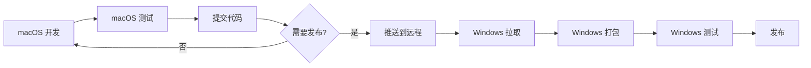

# PrivacyGuard 开发工作流程指南

本文档详细说明 PrivacyGuard 的版本迭代、开发和发布流程。

---

## 目录

1. [核心理念](#核心理念)
2. [推荐工作流程](#推荐工作流程)
3. [版本管理](#版本管理)
4. [macOS 开发流程](#macos-开发流程)
5. [Windows 打包流程](#windows-打包流程)
6. [进度追踪](#进度追踪)
7. [发布流程](#发布流程)

---

## 核心理念

### ✅ 推荐策略：**共享核心代码，平台独立打包**

```
┌─────────────────────────────────────────────────────────┐
│                    共享核心代码                          │
│  ┌──────────┐  ┌──────────┐  ┌──────────────────┐      │
│  │ main.py  │  │ theme.py │  │ requirements.txt  │      │
│  └──────────┘  └──────────┘  └──────────────────┘      │
└─────────────────────────────────────────────────────────┘
                          │
          ┌───────────────┴───────────────┐
          ▼                               ▼
┌─────────────────────┐         ┌─────────────────────┐
│    macOS 平台        │         │    Windows 平台      │
│  (开发和测试)        │         │  (打包和发布)        │
│  platforms/macos/   │         │  platforms/windows/  │
└─────────────────────┘         └─────────────────────┘
```

### 为什么先 macOS 后 Windows？

| 因素 | macOS | Windows |
|------|-------|---------|
| 开发环境 | ✅ 你的主力环境 | ⚠️ 需要切换系统 |
| 测试便利性 | ✅ 即时测试 | ⚠️ 需要传输文件 |
| 调试效率 | ✅ 直接调试 | ⚠️ 远程调试 |
| 打包频率 | 高（开发中） | 低（发布时） |
| 代码修改 | ✅ 直接修改 | ❌ 不修改 |

**结论**：
- ✅ **macOS**: 用于开发、测试、调试核心功能
- ✅ **Windows**: 仅用于打包和发布，不修改代码

---

## 推荐工作流程

### 标准版本迭代流程



### 详细步骤

#### Phase 1: macOS 开发（主力环境）

```bash
# 1. 创建开发分支（可选）
cd /Users/a49144/Desktop/临时coding/PrivacyApp
git checkout -b dev-v36

# 2. 修改版本号
# 编辑 main.py 第 34 行
VERSION = "36.0 - 新功能描述"

# 3. 开发和修改代码
vim main.py

# 4. 本地测试
python main.py

# 5. 提交代码
git add main.py
git commit -m "v36.0: 添加新功能"
```

#### Phase 2: macOS 测试和验证

```bash
# 1. 运行测试
python tests/scripts/test_stability.py

# 2. 打包 macOS 版本（验证）
cd build
bash build_macos_app.sh

# 3. 测试 .app
open dist/PrivacyGuard.app
```

#### Phase 3: 提交到远程仓库

```bash
# 1. 推送到远程
git push origin dev-v36

# 2. 创建 Pull Request（可选）

# 3. 合并到主分支
git checkout main
git merge dev-v36
git push origin main
```

#### Phase 4: Windows 打包（发布时）

```cmd
REM 1. 在 Windows 上拉取最新代码
cd C:\Users\YourName\Desktop\PrivacyApp
git pull origin main

REM 2. 查看版本信息
type main.py | findstr VERSION

REM 3. 执行打包
cd platforms\windows\build
build_windows.bat

REM 4. 测试打包结果
cd ..\releases\v36.0-Windows
PrivacyGuard.exe
```

---

## 版本管理

### 版本号规则

当前版本号格式在 `main.py` 第 34 行：

```python
VERSION = "35.0 - 批量图片选择优化 + 脱敏图片修复"
```

| 部分 | 格式 | 说明 | 示例 |
|------|------|------|------|
| 主版本 | `X.Y` | 主版本.次版本 | `35.0`, `36.0` |
| 描述 | `- 描述` | 功能描述 | `- 批量图片选择优化` |

### 版本号更新流程

#### 1. 开发新版本前

```bash
# 查看当前版本
grep "VERSION =" main.py

# 输出: VERSION = "35.0 - ..."
```

#### 2. 更新版本号

```python
# 编辑 main.py
VERSION = "36.0 - 新功能描述"
```

#### 3. 同步更新 spec 文件（可选）

**macOS spec** (`build/PrivacyGuard.spec`):
```python
'CFBundleVersion': '36.0',
'CFBundleShortVersionString': '36.0',
```

**Windows spec** (`platforms/windows/build/PrivacyGuard_windows.spec`):
不需要修改（从 main.py 读取）

#### 4. 创建版本标签

```bash
# 发布时打标签
git tag -a v36.0 -m "Release v36.0: 新功能描述"
git push origin v36.0
```

### 版本历史记录

更新 `CHANGELOG.md`:

```markdown
## [36.0] - 2026-02-15

### 新增
- 功能 A
- 功能 B

### 修复
- Bug C

### 变更
- 优化 D
```

---

## macOS 开发流程

### 日常开发

#### 1. 启动开发环境

```bash
cd /Users/a49144/Desktop/临时coding/PrivacyApp

# 激活虚拟环境（如果使用）
source venv/bin/activate

# 启动应用
python main.py
```

#### 2. 修改代码

**推荐工具**:
- VS Code / CLion / PyCharm
- Claude Code（CLI）

**修改流程**:
1. 编辑 `main.py`
2. 保存并运行 `python main.py`
3. 测试功能
4. 重复上述步骤

#### 3. 调试技巧

```python
# 启用调试模式
export PRIVACYGUARD_DEBUG=True
python main.py

# 或在代码中添加日志
import logging
logging.basicConfig(level=logging.DEBUG)
```

#### 4. 测试

```bash
# 快速测试
python main.py

# 稳定性测试
python tests/scripts/test_stability.py

# 功能测试
python tests/scripts/verify_word_format.py
```

### macOS 打包（开发中）

**何时需要打包**:
- ✅ 版本发布时
- ✅ 验证打包功能
- ❌ 不需要每次修改都打包

**打包命令**:
```bash
cd build
bash build_macos_app.sh
```

**输出**:
- `dist/PrivacyGuard.app` - 应用程序
- `releases/PrivacyGuard-35.0-macOS.dmg` - 发布包

---

## Windows 打包流程

### 何时需要 Windows 打包

| 场景 | 是否需要 | 说明 |
|------|----------|------|
| 代码修改 | ❌ 否 | 核心代码共享，在 macOS 上测试即可 |
| 功能开发 | ❌ 否 | 等功能稳定后再打包 |
| 版本发布 | ✅ 是 | 发布给 Windows 用户时 |
| Bug 修复 | ✅ 是 | 修复后重新发布 |

### Windows 打包步骤

#### 方法一：在 Windows 上（推荐）

```cmd
REM 1. 拉取最新代码
git pull origin main

REM 2. 查看版本号
findstr "VERSION" main.py

REM 3. 一键打包
cd platforms\windows\build
build_windows.bat

REM 4. 测试打包结果
cd ..\releases\v36.0-Windows
PrivacyGuard.exe

REM 5. 上传发布包
REM 上传到 GitHub Releases 或其他平台
```

#### 方法二：在 macOS 上交叉编译（不推荐）

⚠️ **不推荐**: macOS 无法直接创建 Windows .exe 文件

需要使用以下方式：
- 虚拟机运行 Windows
- Wine 环境打包（可能有问题）
- 远程 Windows 机器

**最佳实践**: 在真实的 Windows 环境中打包

---

## 进度追踪

### 获取版本信息

#### 方法一：查看代码

```bash
# 查看版本号
grep "VERSION =" main.py

# 输出: VERSION = "36.0 - 新功能描述"
```

#### 方法二：运行应用

```python
# 在应用中查看
# 帮助 → 关于
```

#### 方法三：使用脚本

```bash
# 创建版本查询脚本
cat > get_version.sh << 'EOF'
#!/bin/bash
grep "VERSION =" main.py | sed 's/VERSION = //' | sed 's/"//g'
EOF

chmod +x get_version.sh
./get_version.sh
```

### 进度追踪文档

#### 1. DEV_LOG.md（开发日志）

位置: `docs/DEV_LOG.md`

**用途**: 记录每次开发的详细变更

**格式**:
```markdown
## [2026-02-12] v35.1 开发

### 计划
- [x] 功能 A
- [ ] 功能 B

### 完成
- 实现了功能 A
- 修复了 bug C

### 问题
- 问题 D 待解决
```

#### 2. STATUS.md（当前状态）

位置: `docs/STATUS.md`

**用途**: 项目当前状态快照

**内容**:
- 当前版本
- 开发进度
- 已知问题
- 下一步计划

#### 3. ROADMAP.md（路线图）

位置: `docs/ROADMAP.md`（建议创建）

**用途**: 长期规划

**示例**:
```markdown
# PrivacyGuard 开发路线图

## v36.0 - 计划中
- 批量处理优化
- 性能提升

## v37.0 - 规划中
- 云存储支持
- 多语言界面
```

### 创建进度追踪工具

**建议创建**: `scripts/check_progress.py`

```python
#!/usr/bin/env python3
"""查询项目进度和版本信息"""

import re

def get_version():
    """获取当前版本"""
    with open('main.py') as f:
        content = f.read()
        match = re.search(r'VERSION = "(.*?)"', content)
        if match:
            return match.group(1)
    return "Unknown"

def get_git_branch():
    """获取当前分支"""
    import subprocess
    try:
        result = subprocess.run(
            ['git', 'branch', '--show-current'],
            capture_output=True, text=True
        )
        return result.stdout.strip()
    except:
        return "Unknown"

def main():
    print("=" * 60)
    print("  PrivacyGuard 项目进度")
    print("=" * 60)
    print()
    print(f"当前版本: {get_version()}")
    print(f"Git 分支: {get_git_branch()}")
    print()
    print("下一步:")
    print("  1. 查看开发日志: docs/DEV_LOG.md")
    print("  2. 查看项目状态: docs/STATUS.md")
    print("  3. 查看路线图: docs/ROADMAP.md")

if __name__ == "__main__":
    main()
```

---

## 发布流程

### 完整发布检查清单

#### Pre-Release（发布前）

- [ ] 代码审查完成
- [ ] 所有测试通过
- [ ] 版本号已更新
- [ ] CHANGELOG.md 已更新
- [ ] 创建 Git 标签

#### macOS Release

- [ ] macOS 打包成功
- [ ] .dmg 文件测试通过
- [ ] 代码签名完成（如需要）
- [ ] 公证完成（如需要）

#### Windows Release

- [ ] Windows 打包成功
- [ ] .exe 测试通过
- [ ] SHA256 校验和生成
- [ ] 杀毒软件测试

#### Post-Release（发布后）

- [ ] GitHub Release 创建
- [ ] 发布说明发布
- [ ] 用户通知
- [ ] 反馈收集

### 发布脚本示例

**macOS 发布**:
```bash
#!/bin/bash
# release_macos.sh

VERSION=$(grep "VERSION =" main.py | cut -d'"' -f2)

echo "Releasing macOS v$VERSION..."

# 1. 创建标签
git tag -a "v$VERSION" -m "Release v$VERSION"

# 2. 打包
cd build
bash build_macos_app.sh

# 3. 复制发布包
cp dist/PrivacyGuard-*.dmg ../../platforms/macos/releases/

# 4. 推送标签
git push origin "v$VERSION"

echo "macOS v$VERSION released!"
```

---

## 最佳实践

### 1. 代码管理

✅ **推荐**:
- 使用 Git 进行版本控制
- 创建分支进行功能开发
- 定期提交代码

❌ **避免**:
- 直接在 main 分支开发
- 长时间不提交代码
- 忘记写 commit message

### 2. 版本管理

✅ **推荐**:
- 每次发布都更新版本号
- 语义化版本号（主.次.修复）
- 记录详细的 CHANGELOG

❌ **避免**:
- 版本号混乱
- 忘记更新 CHANGELOG
- 跳版本号

### 3. 测试

✅ **推荐**:
- 每次修改后测试
- 发布前全面测试
- 两个平台都测试

❌ **避免**:
- 只测试不打包
- 只打包不测试
- 跳过测试直接发布

---

## 常见问题

### Q: 修改代码后需要立即打包 Windows 版本吗？

**A**: 不需要。在 macOS 上测试通过即可。只在版本发布时才打包 Windows 版本。

### Q: 如何确认当前版本？

**A**: 运行 `grep "VERSION" main.py` 或查看应用"关于"页面。

### Q: Windows 和 macOS 版本功能不一致怎么办？

**A**: 这不应该发生。核心代码（main.py）是共享的，功能应该一致。如果出现不一致，说明使用了平台特定的代码。

### Q: 如何回退到旧版本？

**A**:
```bash
# 查看 Git 标签
git tag

# 检出旧版本
git checkout v35.0
```

---

## 总结

### 推荐工作流程总结

```
1. macOS 开发 → 2. macOS 测试 → 3. 提交代码
                                        ↓
                    4. 需要发布? ─────→─┘
                        │ 是
                        ↓
                    5. 推送到远程
                        ↓
                    6. Windows 拉取
                        ↓
                    7. Windows 打包
                        ↓
                    8. 发布
```

### 关键要点

1. **共享核心代码**: main.py、theme.py 等核心文件在两个平台共享
2. **macOS 主力开发**: 在 macOS 上进行所有开发和测试
3. **Windows 仅打包**: Windows 只用于打包发布，不修改代码
4. **版本同步**: 通过 Git 同步代码，确保版本一致
5. **进度追踪**: 使用 DEV_LOG.md、STATUS.md 等文档追踪进度

---

**最后更新**: 2026-02-12
**文档版本**: 1.0
